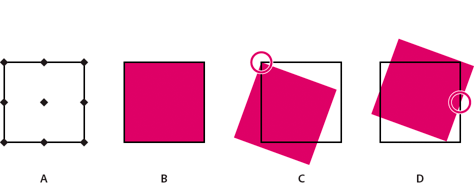

# Protocolo de servidor FXG{#fxg-server-protocol}

Para manipular un gráfico, se pueden usar puntos de referencia similares a las direcciones de una brújula.

Así, un gráfico se puede rotar, ajustar a escala o cambiar de tamaño en relación con un punto de referencia concreto. Los puntos de referencia son `northWest`, `north`, `northEast`, `west`, `center`, `east`, `southWest`, `south` y `southeast`. Por ejemplo, si utiliza el punto de referencia central, puede girar un gráfico 45° sobre su centro. La siguiente imagen muestra dónde se encuentran los puntos de referencia, un gráfico, el gráfico girado 20° desde su punto de referencia `northWest` y el gráfico girado 20° desde su punto de referencia `east`.

* A. Ubicaciones de los puntos de referencia
* B. Gráfico
* C. El gráfico giró 20° desde su punto de referencia `northWest`
* D. El gráfico giró 20° desde su punto de referencia `east`

La sintaxis es la siguiente:

`referencePoint <string> (northWest, north, northEast, west, center, east, southWest, south, southEast, none, inherit)`

El valor predeterminado es ninguno. El valor `inherit` pasa el valor `s7:referencePoint`, siempre que no sea `none`, desde la parte superior del nivel de página o grupo a todos los elementos secundarios. La configuración `none` significa que no hay ningún punto de referencia para el objeto y que se utiliza el sistema de coordenadas FXG.

>[!NOTE]
>
>para utilizar un punto de referencia sin que se produzca ningún desplazamiento en el objeto después de su manipulación, actualice los valores x e y del objeto tras manipularlo.

Cuando se utiliza un valor de `s7:referencePoint` con grupos (o rutas, elementos de línea o cualquier elemento que no tenga definiciones explícitas de anchura y altura), el valor se aplica al cuadro delimitador acumulado del grupo. Por ejemplo, el punto superior izquierdo del cuadro delimitador de todos los objetos del grupo sirve como punto de referencia `northWest` para el grupo; el punto inferior derecho sirve como punto de referencia `southEast`.
