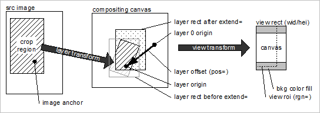

# Colocación de capas{#layer-placement}

Las capas se colocan alineando el origen de la capa (origin=) con el origen de la capa de fondo en un desplazamiento especificado por pos=.

Si el origen de la capa no se especifica explícitamente para una capa de imagen, se calcula de la siguiente manera:

1. Determine el anclaje de la imagen. Use `anchor=` o, si no se especifica, `catalog::Anchor`.
1. Si se define el anclaje de imagen, aplique las transformaciones de capa y `extend=` para convertirlo en un origin= value.
1. Si no se define ningún anclaje de imagen, el origen de la capa se coloca en el centro del rectángulo de capa (después de aplicar `extend=`).

