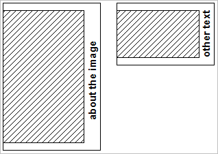

# Ejemplo B{#example-b}

Requisitos similares a los del ejemplo A, pero utilizar un fondo de color sólido y permitir que la altura del compuesto varíe para acomodar imágenes con diferentes relaciones de aspecto.

<table id="simpletable_37BA3B2A75A9468C9ADEBBC034BADAE7"> 
 <tr class="strow"> 
  <td class="stentry"> 
 catálogo::Id 
 </td> 
  <td class="stentry"> 
 catálogo::Modificador 
</td> 
 </tr> 
 <tr class="strow"> 
  <td class="stentry"> 
 myTemplate2 
</td> 
  <td class="stentry"> 
 $text=layer+1+text+gues+here&amp; layer=0&amp;size=800,0&amp;extend=0,100,200,100&amp;src=$object$&amp;originN=.5,0&amp; layer=1&amp;text=rtf...$text$...rtf-encoding&amp;rotate=-90&amp;originN=.5,0&amp;posN=0.5,0 
</td> 
 </tr> 
</table>

La imagen se coloca en la capa 0 y el valor de altura de `size=` se establece en 0. Esta configuración hace que la altura real esté determinada por la altura de la imagen después de escalarla a 800 píxeles de ancho.

La variable `extend=` agrega 100 píxeles a la parte superior e inferior, y 200 píxeles a la derecha.

Los orígenes de la capa 0 y de la capa 1 se colocan en el centro-derecha del área de composición, para lograr la posición de texto deseada.

La siguiente imagen muestra el resultado compuesto para diferentes proporciones de aspecto de la imagen y diferentes cadenas de texto.

