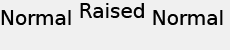

# Colocación de texto{#text-positioning}

El procesador text= coloca el texto fundamentalmente en una posición diferente al procesador textPs= cuando se aplica a capas de tamaño previo (es decir, cuando se especifica size= también).

Las capas `text=`y `textPs=` de tamaño propio tienen una apariencia y posición similares.

`textPs=` alinea la parte superior de la celda de caracteres con la parte superior del cuadro de texto (suponiendo  `\vertalt`), aunque esto resulte en que partes de los glifos de texto procesados se extiendan parcialmente fuera del límite del cuadro de texto. Los glifos procesados de determinadas fuentes también pueden sobresalir ligeramente por encima de los bordes izquierdo y derecho del cuadro de texto. Para las aplicaciones que requieren que todo el texto procesado esté contenido dentro del rectángulo de capa, se pueden utilizar los comandos RTF `\marg*` o `textFlowPath=` para ajustar el área de procesamiento del texto.

Por el contrario, `text=` cambiará el texto procesado según sea necesario y garantizará que todos los glifos procesados encajen completamente dentro del cuadro de texto especificado.

Mientras que `text=` puede ser un poco más fácil de usar para aplicaciones simples, `textPs=` oferta la posición precisa independientemente de las caras de las fuentes y los efectos de texto.

## Ejemplos {#section-1b6bdf2ea34447528188ae4e1430ee71}

Los siguientes ejemplos son para texto de tamaño previo. El comportamiento del texto con tamaño propio es diferente.

** `Text=` siempre proporciona un margen estrecho en la parte superior:**

`/is/image/?size=230,50&bgc=f0f0f0&fmt=png&text=\fs40Normal%20Normal%20Normal`

** `textPs=` representa el texto perfectamente alineado en la parte superior del cuadro de texto, lo que puede resultar en un ligero recorte, incluso para fuentes comunes como Arial:**

`/is/image/?size=230,50&bgc=f0f0f0&fmt=png&textPs=\fs40Normal%20Normal%20Normal`

** `text=` desplazará automáticamente el texto procesado hacia abajo para evitar el recorte:**

`/is/image?size=230,50&bgc=f0f0f0&fmt=png&text=\fs40Normal%20{\up20Raised%20}Normal`

** `textPs=` no moverá texto que contenga partes levantadas, lo que resultará en un recorte significativo si el texto está en la capa 0:**

`/is/image?size=230,50&bgc=f0f0f0&fmt=png&textPs=\fs40Normal%20{\up20Raised%20}Normal`

**Un margen de 10 pt (200 twips) en la parte superior procesa este texto sin recorte:**

`/is/image?size=230,50&bgc=f0f0f0&fmt=png&textPs=\margt200\fs40Normal%20{\up20Raised}%20Normal`

**Los glifos procesados de determinadas fuentes de secuencias de comandos pueden extenderse significativamente fuera del cuadro de texto:**

`/is/image?size=230,50&bgc=f0f0f0&fmt=png&textPs={\fonttbl{\f1\fcharset0%20FluffyFont;}}\f1\fs88%20fluffy%20font%20problems`
