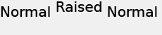

# Posición del texto{#text-positioning}

El procesador `text=` coloca el texto de forma fundamentalmente diferente al procesador textPs= cuando se aplica a capas con tamaño previo (es decir, cuando se especifica size= también).

Las capas `text=` y `textPs=` de tamaño personalizado tienen un aspecto y una posición similares.

`textPs=` alinea la parte superior de la celda de caracteres con la parte superior del cuadro de texto (suponiendo `\vertalt`), incluso si el resultado es que partes de los glifos de texto procesados se extiendan parcialmente fuera del límite del cuadro de texto. Los glifos procesados de ciertas fuentes también pueden sobresalir ligeramente más allá de los bordes izquierdo y derecho del cuadro de texto. Para las aplicaciones que requieren que todo el texto procesado esté contenido en el rectángulo de capa, se pueden utilizar los comandos RTF `\marg*` o `textFlowPath=` para ajustar el área de procesamiento de texto.

Por el contrario, `text=` cambia el texto procesado según sea necesario y garantiza que todos los glifos procesados se ajusten completamente al cuadro de texto especificado.

Aunque `text=` puede ser un poco más fácil de usar para aplicaciones sencillas, `textPs=` ofrece una colocación precisa independientemente de las caras de las fuentes y los efectos de texto.

## Ejemplos {#section-1b6bdf2ea34447528188ae4e1430ee71}

Los siguientes ejemplos son para texto con tamaño previo. El comportamiento para el texto de tamaño personalizado es diferente.

** `Text=` siempre proporciona un margen estrecho en la parte superior:**

`/is/image/?size=230,50&bgc=f0f0f0&fmt=png&text=\fs40Normal%20Normal%20Normal`

** `textPs=` procesa el texto alineado con precisión con la parte superior del cuadro de texto, lo que da como resultado un ligero recorte, incluso para fuentes comunes como Arial®:**

`/is/image/?size=230,50&bgc=f0f0f0&fmt=png&textPs=\fs40Normal%20Normal%20Normal`

** `text=` desplaza automáticamente el texto procesado hacia abajo para evitar el recorte:**

`/is/image?size=230,50&bgc=f0f0f0&fmt=png&text=\fs40Normal%20{\up20Raised%20}Normal`

** `textPs=` no mueve el texto que contiene partes elevadas, lo que provoca un recorte significativo si el texto se encuentra en la capa 0:**

`/is/image?size=230,50&bgc=f0f0f0&fmt=png&textPs=\fs40Normal%20{\up20Raised%20}Normal`

**Un margen de 10 pt (200 twips) en la parte superior procesa este texto sin recortar:**

`/is/image?size=230,50&bgc=f0f0f0&fmt=png&textPs=\margt200\fs40Normal%20{\up20Raised}%20Normal`

**Los glifos procesados de ciertas fuentes de script pueden extenderse significativamente fuera del cuadro de texto:**

`/is/image?size=230,50&bgc=f0f0f0&fmt=png&textPs={\fonttbl{\f1\fcharset0%20FluffyFont;}}\f1\fs88%20fluffy%20font%20problems`
